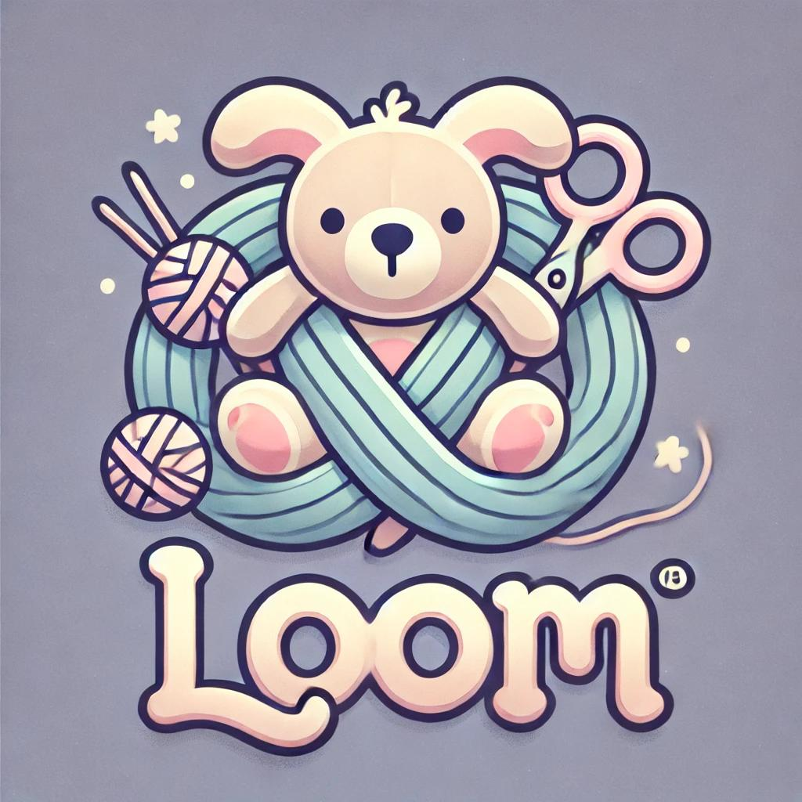

# loom-companion-app

The Loom Companion App is inspired by the story Loom, where stuffed animals protect children from their deepest fears and nightmares. This app allows users to create and manage their own characters within the Loom universe, customizing stuffed animal companions that guard their Person (a child) from various nightmares.

Built as a full-stack application, the Loom Companion App features its own working API and front-end tools that provide full CRUD (Create, Read, Update, Delete) functionality. Users can create profiles for their children, design stuffed animals, and track the child's fears, all while seamlessly managing data through a user-friendly interface.

## User Stories

AAU, I want to create a profile for a child so that I can track their stuffed animals and fears.

AAU, I want to add stuffed animals to a child's profile so that I can see who is protecting them from their fears.

AAU, I want to add and describe the child's fears so that I can monitor what is causing them distress.

AAU, I want to edit the details of a child or stuffed animal so that I can update their information as the story progresses.

AAU, I want to delete a stuffed animal or fear if it is no longer relevant to the child's protection.

## MVP

The MVP for the Loom Companion App will have the following:

1. Read information on characters, stuffed animals, fears, etc.
2. A home screen where users can view all characters.

## Stretch Goals

1. Full CRUD functionality for characters, stuffed animals and fears.

## Links

[ERD](https://drive.google.com/file/d/1OntQVeyVJKAzP7HFGClC1jQxIjim5eES/view?usp=sharing)

[Wireframe](https://drive.google.com/file/d/11WIulf6OQDkxL2Bzn0Ys0fX-QjHkH7Iv/view?usp=sharing)
